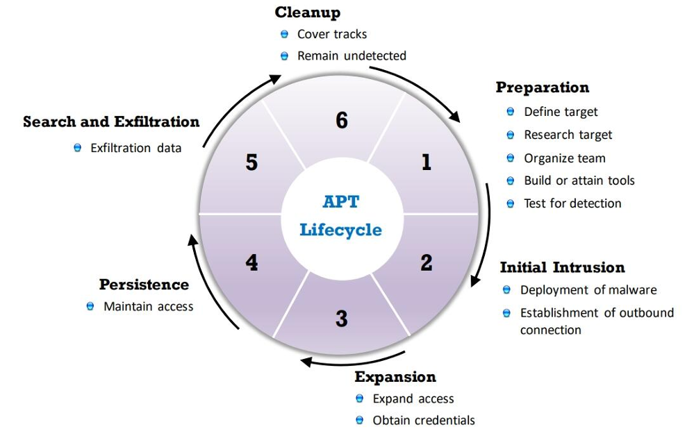
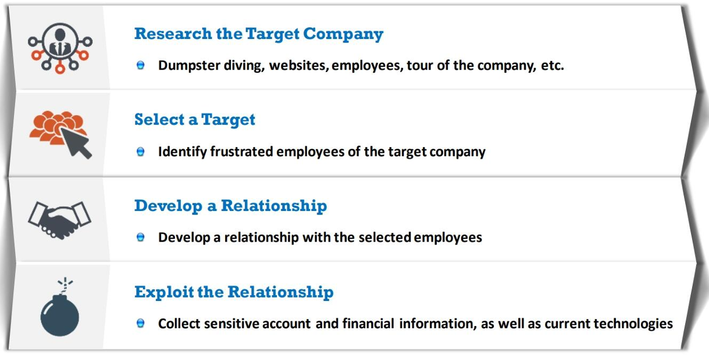
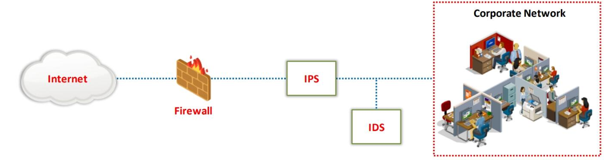
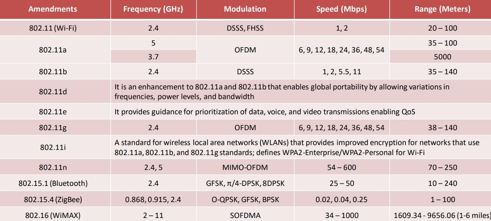
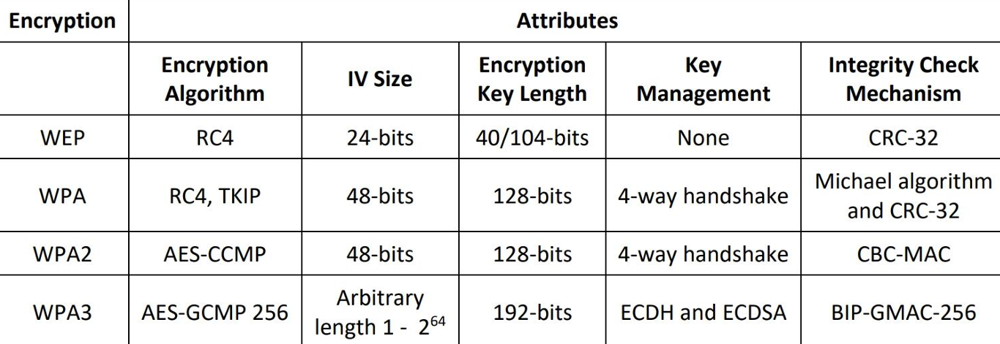

# INTRODUCTION TO ETHICAL HACKING {01}
## The information security law or standard

- **Sarbanes-Oxley Act (SOX)**: This U.S. federal law was enacted in response to corporate accounting scandals (e.g., Enron, WorldCom) to improve the accuracy and reliability of financial reporting. It establishes requirements for financial disclosures, internal controls, and auditing practices to prevent accounting errors and fraudulent activities, thus protecting stakeholders and the public.

- **ISO/IEC 27001:2013**: This is an international standard for information security management systems (ISMS) that provides a framework for managing and protecting sensitive information.

- **PCI-DSS** (Payment Card Industry Data Security Standard): This standard is designed to protect cardholder information and ensure secure payment transactions.

- **FISMA** (Federal Information Security Management Act): This U.S. law focuses on securing federal information systems.

### Policies

1. **Remote-access policy**: This policy governs how users can remotely access the network and what methods are allowed for such access. Dial-out modems are a form of remote access, so this policy will provide guidance on whether their use is permitted or restricted.

2. **Permissive policy**: This is not a standard security policy term. It may refer to policies that are less restrictive, but it’s not specifically related to remote access or modems.

3. **Acceptable-use policy**: This policy outlines acceptable behaviors and uses of network resources. While it might include some information about devices and their use, it is not specifically focused on remote access methods like dial-out modems.

4. **Firewall-management policy**: This policy deals with the configuration and management of firewalls. It is not directly concerned with the use of dial-out modems or remote access methods.

## SAST AND DAST
#### SAST (Static Application Security Testing)

It is a type of white box testing method meaning they require access to source code to function. It finds all security vulnerabilities including software flaws and weaknesses such as SQL injection and others by examining code before it is deployed. SAST does not require a running system to perform evaluations.
#### DAST (Dynamic Application Security Testing) 

It is a type of black-box testing method which means that tests are performed from outside a functioning application rather than viewing into internal source code or application architecture. It is running to find a broad range of vulnerabilities by examining application. DAST requires a running system to perform evaluations.

## **DNS Record Types and Their Functions**

- **A**:  
  - The IPv4 address of the domain.

- **AAAA**:  
  - The domain’s IPv6 address.

- **CNAME**:  
  - The canonical name — allows one domain name to map onto another. This allows multiple websites to refer to a single web server.

- **MX**:  
  - The server that handles email for the domain.

- **NS**:  
  - One or more authoritative name server records for the domain.

- **TXT**:  
  - A record containing information for use outside the DNS server. The content is in the form `name=value`. This information is used for various purposes, including authentication schemes such as SPF and DKIM.

## Cyber Kill Chain Methodology


# CVSS Rating


# FOOTPRINTING AND RECONNAISSANCE {02}

### NetCraft

- Obtaining information about the target network operating system. Gathering internal URL of the target website.

### Traceroute (tracert on Windows)

- This work on the concept of ICMP protocol and use the TTL field in the header of ICMP packets to discover the routers on the path to a target host
- Find the IP addresses of intermediate devices such as routers and firewalls present between a source and its destination.

### Google Hacking (Dorking)

**[related:]** 
   - Finds websites that are similar to a specific URL. For example, `related:example.com` will show websites that are similar to `example.com`.

**[site:]**
   - Searches within a specific website or domain. For example, `site:example.com` will show results only from `example.com`.

**[inurl:]**
   - Finds pages with a specific word in the URL. For example, `inurl:login` will show pages where the URL contains the word `login`.

**[info:]**
   - Provides information about a specific URL, such as its cached version or related sites. For example, `info:example.com` shows details about `example.com`, like a cached version or other information Google has about it.
**[index of]**
   - Displays a directory listing of files and folders on a web server. For example, `index of /images` shows a list of files and directories located in the `/images` directory of a website.
 
**[intitle:]**
   - Searches for pages with a specific string in the title. For example, `intitle:"best practices"` returns pages with "best practices" in the title.

**[link:]**
   - Finds pages that link to a specific URL. For example, `link:example.com` shows pages that have links pointing to `example.com`.

**Metagoofil** - Command line interface that uses Google hacks to find information in meta tags (domain, filetype, etc; Is a google dorks for terminal).

# ENUMERATION {03}

##### Diff btw Scanning and Enumeration
##### Scanning provides a broad overview of active systems, open ports, and services, while enumeration digs deeper into those services to extract detailed, actionable information.

### Net View Commands
#### Displays all the shares in the domain:
`net view / domain`
##### Displays all the shares on the specified domain:
`net view /domain:<domain name>`
### MIB (Management Information Base)

`LNMlB2.MlB`: Contains object types for workstation and server services
`DHCP.MIB`: Monitors network traffic between DHCP servers and remote hosts
`HOSTMIB.MIB`: Monitors and manages host resources
`MIB_II.MIB`: Manages TCP/lP-based Internet using a simple architecture and system
`WINS.MIB`: For the Windows Internet Name Service (WINS)
### SMTP Enumeration
`VRFY` - Validates users
`EXPN` - Shows the actual delivery addresses of aliases and mailing lists
`RCPT TO` - Defines the recipients of a message

# SCANNING NETWORKS {04}

#### To perform stack fingerprinting with Nmap, you would use the `-O` option, which enables OS detection. The stack fingerprinting is part of the OS detection process.
### Nmap Flags:

**`-sA`**: **TCP ACK Scan**
- Sends ACK packets to determine if ports are filtered or unfiltered. Useful for mapping firewall rules. 
- Determining whether they are stateful or not and which ports are filtered

 **`-sS`**: **TCP SYN Scan** (Stealth Scan)
   - Sends SYN packets to target ports and analyzes responses to determine open or closed ports without completing the full TCP handshake.

**`-D`**: **Decoy scanning**
- Flag is used to cloak your IP address by adding decoys during a scan. It makes it harder for the target to detect the actual scanner, as multiple decoy IP addresses are used.
- This technique makes it difficult for the IDS or firewall to determine which IP address was actually scanning the network and which IP addresses were decoys.

 **`-sT`**: **TCP Connect Scan**
   - Completes the full TCP handshake with target ports to determine their status. More detectable but simpler than SYN scan.

 **`-sU`**: **UDP Scan**
   - Scans for open UDP ports. UDP scanning can be slower and less reliable due to the nature of the UDP protocol.

 **`-sP`** (now replaced by **`-sn`**): **Ping Scan**
   - Detects live hosts on a network by sending ICMP Echo requests. The **`-sn`** flag is now used to perform a ping scan without port scanning.

 **`-sN`**: **TCP Null Scan**
   - Sends packets with no flags set. Useful for evading certain types of firewalls and intrusion detection systems.

 **`-sF`**: **TCP FIN Scan**
   - Sends FIN packets to ports. Useful for detecting open ports by analyzing responses to FIN packets.

 **`-sX`**: **TCP Xmas Scan**
   - Sends packets with FIN, PSH, and URG flags set. This scan can sometimes bypass firewalls and detect open ports.

 **`-O`**: **OS Detection**
   - Attempts to determine the operating system of the target by analyzing TCP/IP stack behavior and responses.

 **`-p`**: **Port Specification**
   - Used to specify which ports to scan. Example: `-p 80,443` scans ports 80 and 443. `-p-` scans all 65,535 ports.

 **`-T`**: **Timing Template**
   - Adjusts the speed of the scan to balance between speed and stealth. Ranges from 0 (Paranoid) to 5 (Insane). Example: `-T4` for faster scanning.

**`-A`**: **Aggressive Scan**
   - Enables OS detection, version detection, script scanning, and traceroute. Example: `nmap -A 192.168.1.1`.

 **`-v`**: **Verbose Mode**
- Increases the amount of output detail. Example: `-v` for basic verbosity, `-vv` for more detailed information.

 **`-oN`**: **Output to Normal File**
   - Saves the scan results in a normal text file format. Example: `-oN output.txt`.

 **`-oX`**: **Output to XML File**
   - Saves the scan results in an XML file format. Example: `-oX output.xml`.

 **`-oG`**: **Output to Grepable File**
   - Saves the scan results in a grepable format. Example: `-oG output.gnmap`.

 **`--script`**: **Script Scan**
   - Executes Nmap Scripting Engine (NSE) scripts to perform additional checks and gather more information. Example: `--script vuln` for vulnerability-related scripts.

**`-Pn`**: **No Ping Scan**
   - Tells Nmap not to ping the target before scanning. Useful for scanning hosts that block ICMP ping requests or when you suspect that a firewall might block pings. It assumes the host is up and proceeds directly to the port scan.

19. **`-PU`**: **UDP Ping Scan**
   - Sends empty UDP packets to the specified ports to determine if the host is up. If the target responds (e.g., with an ICMP port unreachable message), Nmap considers the host to be up. It is often used to discover hosts that might not respond to ICMP pings but have open UDP ports.

20. **`-PP`**: **ICMP Echo Ping Scan**
   - Sends an ICMP Echo Request (ping) to determine if a host is up. This is the standard ping method, where the host replies with an ICMP Echo Reply if it is reachable and not blocking ICMP requests. . Timestamp and address mask queries.

21. **`-PY`**: **SCTP INIT Ping Scan**
   - Sends an SCTP INIT chunk to the target, which is part of the Stream Control Transmission Protocol (SCTP) handshake. This scan is used to detect whether the host is up by determining if it supports SCTP, a protocol used in some telecommunications networks.

## NULL scan

- This type of scan sends a TCP packet with no flags set. 

- **Open Port**:  No response.

- **Closed Port**: The TCP stack on the target typically responds with a RST (Reset) packet. This indicates that the port is not accepting connections and is closed.

## UDP Scan

- A UDP scan sends a UDP packet to a target port without requiring a connection setup (like TCP does with its handshake). Since UDP is connectionless, the scan relies on the target's response (or lack thereof) to infer the port's status.

- **Open Port**: No response,
  However, in some cases (e.g., DNS on port 53), an open port might respond with a valid UDP reply.

- **Closed Port**:  ICMP Port Unreachable

- **Filtered Port**: No response will be received, and the status will be marked as **filtered** by the scanner.
## ARP Ping Scan

- **ARP (Address Resolution Protocol) Ping Scan** is a network scanning technique used to identify active hosts on a local network by sending ARP requests and analyzing the responses.
- Unlike traditional ping scans that use ICMP packets, ARP scans operate at the data link layer, making them highly effective for discovering devices within the same subnet.
## TCP Maimon Scan

- The probe used here is FIN/ACK. In most cases, to determine if the port is open or closed, the RST packet should be generated as a response to a probe request. 

## ACK Flag Probe Scan

- **ACK Flag Probe Scan** is a technique used primarily to map out firewall rules and determine whether ports are filtered or unfiltered by sending TCP packets with only the ACK flag set.

### Unicornscan

- The OS of the target machine can be identified by observing the TTL values in the acquired scan result
### TTL values for various operating systems:

`Windows: 128
`Linux: 64
### ICMP scan with Hping2
`hping2 -1 host.domain.com`
### IP spoofing using Hping3
`Hping3 www.certifiedhacker.com —a 7 . 7 . 7 . 7`
### Conduct a subnet-wide scan with Hping3
`hping3 -1 10.0.1.x --rand-dest -I eth0`

# VULNERABILITY ANALYSIS {05}

### Post Assessment Phase

1. Risk Assessment
2. Remediation
3. Verification
4. Monitoring

# SYSTEM HACKING {06}

### Buffer Overflow
 
- A buffer is a block of memory allocated to store data during program execution. A **buffer overflow** occurs when a program writes more data than the buffer can hold, causing it to overwrite neighboring memory locations. This vulnerability can be exploited by attackers to inject malicious code, leading to actions like file damage, data modification, unauthorized access, privilege escalation, or gaining shell access.
## Privilege Escalation

- Exploit against a local vulnerability
### Types of Privilege Escalation

#### Horizontal Privilege Escalation

- Refers to acquiring the same privileges that have already been granted, by assuming the identity of another user with the same privileges.

#### Vertical Privilege Escalation

- Refers to gaining higher privileges than those existing

### Common RIDs and Their Associated Accounts

- **500**: `Administrator` – The default administrative account.
- **501**: `Guest` – The default guest account.
- **502**: `KRBTGT` – Account used for Kerberos Ticket Granting Ticket (TGT).
- **512**: `Domain Admins` – A group that typically has administrative privileges across the domain.
- **513**: `Domain Users` – The default group for regular user accounts in a domain.
- **514**: `Domain Guests` – The default group for guest accounts in a domain.
- **544**: `Administrators` – A group on a local machine that has administrative privileges.
- **545**: `Users` – A group on a local machine that typically has limited privileges.
- **546**: `Guests` – A group on a local machine that includes the Guest account.
- **555**: `Remote Desktop Users` – A group for users allowed to connect remotely.

#### Privilege Escalation Using Spectre and Meltdown Vulnerabilities

- Spectre and Meltdown are vulnerabilities found in the design of modern processor chips from AMD, ARM, and Intel

# MALWARE THREATS {07}

## Components of Malware

### Crypters

Software that protects malware from undergoing reverse engineering or analysis, thus making the task of the security mechanism harder in its detection.

### Dropper

A type of Trojan that covertly installs other malware files on to the system

### Wrapper

A wrapper `binds a Trojan executable` with genuine looking `.EXE` applications,
such as games or office applications.

### Obfuscator

A program that conceals its code and intended purpose via various techniques, and thus, makes it hard for security mechanisms to detect or remove it

## Advanced Persistent Threat Lifecycle


## Malware

### Trojans

- It is a program in which the malicious or harmful code is contained inside an apparently harmless program or data, which can later gain control and cause damage.
- It `create a covert communication channel` between the victim computer and the attacker for `transferring sensitive data`.

### Types of Trojans

#### Rootkits

   - This `avoid detection` by `hiding different services`,  `connections`, and `other system drivers`.
#### Viruses

   - A virus is a `self-replicating program` that produces its own copy by attaching itself to another program, computer boot sector or document.
#### Worms
   
   - These are malicious programs that `independently replicate`, `execute`, and `spread across the network connections`, thus consuming available computing resources without human interaction.
#### Fileless malware 

   - Also known as non-malware, `infects legitimate software`, `applications`, and other protocols existing in the system to perform various malicious activities
   - It leverages any existing vulnerabilities to infect the system.
   - It `resides in the system's RAM`. It injects malicious code into the running processes such as Microsoft Word, Flash, Adobe PDF Reader, Javascript, and PowerShell.  
### Types of Viruses

- **Stealth Virus**: This designed to hide from antivirus programs by altering system responses. It intercepts system requests to make infected files appear normal.

- **Macro Virus**: It uses macros in Office documents to spread.

- **Multipart Virus**: A virus with multiple components, infecting different file types or systems. 

- **Polymorphic Virus**: This changes its code structure each time it runs to evade detection. 

- **Tunneling Virus**: This bypasses antivirus detection by intercepting system interrupts or BIOS calls before they reach the antivirus software.

- **Cavity Virus**: Also known as a space filler virus, it hides by inserting its code into unused spaces within a file, keeping the file size unchanged and evading detection.

- **Encryption Virus**: This encrypts its code to avoid detection. It uses a new encryption key each time it infects a file, making it difficult for antivirus tools to recognize.

# SNIFFING {08}

## Types of Sniffing

### Passive Sniffing

- It `sniffing through a hub`, wherein the traffic is sent to all ports
- It involves monitoring packets sent by others without `sending any additional data packets` in the network traffic

### Active Sniffing

- Is used to sniff a `switch-based network`.
- It involves `injecting Address Resolution Packets (ARP)` into the network to flood the switch's Content Addressable Memory (CAM) table, which keeps track of host-port connections

### Sniffers operate at the `data link layer` of the OSI model

### SPAN port 

- is a port that is configured to receive a copy of every packet that passes through a switch.

### Wiretapping

- Wiretapping is the process of the monitoring of `telephone` and `Internet` conversations by a third party
- Attackers `connect a listening device` (hardware, software, or a combination of both) to the circuit carrying information between two phones or hosts on the Internet
- It allows an attacker to `monitor`, `intercept`, `access`, and `record information` contained in a data flow in a communication system

### MAC Flooding

- It involves the `flooding of the CAM table with fake MAC address and IP pairs` until it is full
- The switch then `acts as a hub by broadcasting packets` to `all machines` on the network, and therefore, the attackers can sniff the traffic easily

### Mac Flooding Switches with macof

- This tool floods a switched LAN with MAC addresses, potentially causing the switch to operate in broadcast mode. 
- It is used to exploit network switches and facilitate network traffic sniffing.

### DHCP Starvation Attack

- This is a denial-of-service (DoS) attack on the DHCP servers where the attacker broadcasts `forged DHCP requests` and `tries to lease all the DHCP addresses available` in the DHCP scope
- Therefore, the legitimate user is `unable to obtain or renew an IP address` requested via DHCP, and fails to get access to the network

### Defend Against DHCP Starvation ==> Enable port security

### Defend Against ARP Poisoning ==> Implement Dynamic ÄRP Inspection

### Defend Against DNS Spoofing ==> DNSSEC (Domain Name System Security Extension)

### IRDP (ICMP Router Discovery Protocol) Spoofing

- It enables hosts to `find active routers` on their subnet. 
- An attacker can `send fake IRDP router advertisements` to trick hosts into changing their default router to one controlled by the attacker. 
- This allows the `attacker to intercept traffic, leading to man-in-the-middle, denial-of-service, or passive sniffing attacks`.

### STP (Spanning Tree Protocol) Attack

- Attackers connect a `rogue switch` into the network to change the operations of the `STP protocol` and sniff all the network traffic
- Attackers configure the rogue switch such that its priority is less than that of any other switch in the network, which makes it the root bridge, thus allowing the attackers to `sniff all the traffic` flowing in the network

### Intranet DNS Spoofing

- The attacker's system must be connected to the `local area network (LAN)` and be `able to sniff packets`
- It works well `against switches with ARP Poison Routing`.

### Internet DNS Spoofing

- The attacker `infects John's machine` with a Trojan and `changes his DNS IP address` to that of the attacker's

# SOCIAL ENGINEERING {09}

## Phases of a Social Engineering Attack



## Types of Social Engineering

### Human-based Social Engineering

**Impersonation**

   - The attacker pretends to be someone else, often a trusted individual or authority figure, to manipulate the victim into providing information or access.

**Vishing (Voice Phishing)**:
   - Attackers use phone calls to impersonate legitimate entities, such as banks or tech support, to extract personal information from victims.

**Eavesdropping**

   - Unauthorized listening of conversations, or reading of messages 
   - Can be done using communication channels such as telephone lines, email, instant messaging, etc.

**Shoulder Surfing**

   - Direct observation techniques such as looking over someone's shoulder to get information such as passwords, Pl Ns, account numbers, etc.

**Dumpster Diving**

   - Attackers search through trash bins for discarded documents, hardware, or other items that may contain sensitive information.

**Reverse Social Engineering**

   - The attacker presents him as an authority and the target seeks his or her advice before or after offering the information that the attacker needs

**Piggybacking**

   - An `authorized person intentionally or unintentionally allows` an `unauthorized person` to pass through a secure door e.g., "l forgot my ID badge at home. Please help me"

**Tailgating**

   - The attacker, wearing a fake ID badge, enters a secured area by closely following an authorized person through a door that requires key access.

**Diversion Theft**

- The `attacker tricks a person responsible for making a genuine delivery` into delivering the consignment to a location other than the intended location

**Honey Trap**

- Attackers target a person inside the company online, pretending to be an attractive person. They then begin a fake online relationship to `obtain confidential information` about the target company.

**Baiting**

- Attackers offer something enticing, like a free USB drive or a download, which when accessed, installs malware or steals information from the victim's device.

**Quid Pro Quo (Something for something)**

- An attacker `offers a service or benefit in exchange for information or access`, such as pretending to be IT support and offering help in return for login credentials.

**Elicitation**

- The attacker subtly prompts the victim to reveal information through casual conversation or questioning, often without the victim realizing they are divulging sensitive information.


**Name-dropping**: This tactic involves mentioning well-known people or organizations to create a sense of credibility or authority. While it can be persuasive, it is often used in conjunction with other tactics rather than as a standalone method for swaying a victim.

### Computer-based Social Engineering

**Chain Letters**

- Emails that `offer free gifts such as money` and software on condition that the `user forwards the mail to a specified number of people`.

### Types of Phishing

**Spear Phishing**

   - A targeted phishing attack aimed at specific individuals within an organization. 
   - Attackers send spear phishing to send a message with specialized, social engineering content directed at a specific person, or a small group of people.

**Whaling**

- An attacker `targets high profile executives like CEOs, CFOs, politicians, and celebrities` who have complete access to confidential and highly valuable information.
  
**Pharming**

   - The attacker `redirects web traffic to a fraudulent website` by installing a malicious program on a personal computer or server.
   - Also known as "phishing without a lure", and performed by using `DNS Cache Poisoning` or `Host File Modification`.

**Spimming**

   - A `variant of spam` that `exploits Instant Messaging platforms` to flood spam across the networks
   - Attacker `uses bots to harvest Instant Message IDs` and spread spam

### Doxxing

- Publishing PII about an individual usually with a malicious intent.

### SET (Social Engineering Toolkit)

- This is an open-source Python-driven tool aimed at penetration testing around social engineering.

# DENIAL-OF-SFRVOCE {10}

### Hit-List Scanning Technique

- Through scanning, an attacker first collects a list of potentially vulnerable machines and then creates a `zombie army OR botnet army`. 
- The attacker scans the list to find a vulnerable machine. On finding one, the attacker installs malicious code on it and divides the list in half. 
- The attacker continues to scan one half, whereas the other half is scanned by the newly compromised machine. 

### UDP flood Attack

- An attacker sends spoofed UDP packets at a very high packet rate to a remote host on random ports of a target server using a large source IP range

### ICMP flood attacks

- These are a type of attack in which attackers send large volumes of ICMP echo request packets to a victim system directly or through reflection networks

### Ping of Death Attack

- Attacker tries to crash, destabilize, or freeze the targeted system or service by `sending malformed or oversized packets` using a simple ping command
- For instance, the attacker sends a packet which has a `size of 65,538 bytes` to the target web server. This `packet size exceeds the size limit prescribed by RFC 791 IP`, which is 65,535 bytes. The reassembly process of the receiving system might cause the system to crash

### Smurf attack

- Attacker spoofs the `source IP address` with the victim's IP address and sends a large number of `ICMP ECHO request packets` to an IP broadcast network
- This causes all the hosts on the broadcast `{FF:FF:FF:FF:FF:FF}` network to respond to the received `ICMP ECHO requests`. These responses will be sent to the victim machine, ultimately causing the machine to crash

### SYN Flood Attack

- An attacker floods a target server with `fake SYN requests`, using `fake source IP addresses`. The `server responds with SYN/ACK and waits for an ACK` that never arrives due to the fake addresses. This `exploits a flaw in the TCP handshake`, forcing the server to hold partial connections in its `"listen queue" for 75 seconds`. As the queue fills up, the server is overwhelmed, leading to a Denial-of-Service (DoS) attack.
- Fill up connection buffers in the `operating system`.

### Spoofed Session Flood Attack

- Attackers `create fake or spoofed TCP sessions` by carrying multiple `SYN`, `ACK`, and `RST` or `FIN packets`
- Attackers employ this attack to `bypass firewalls` and `perform DDoS attacks` against the target network, exhausting its network resources

### Slowloris Attack

- The `attacker sends partial HTTP requests` to the target web server or application.
- Upon receiving the partial HTTP requests, the `target server opens multiple open connections` and `keeps waiting for the requests to complete`.
- These requests will not be complete, and as a result, the target server's `maximum concurrent connection` pool will be exhausted, and additional connection attempts will be denied

### R-U-Dead-Yet? (RUDY)

- Is a type of denial-of-service (DoS) attack tool that exploits a vulnerability in web servers by sending long-form field submissions to exhaust server resources.
# SESSION HIJACKING {11}

### Session Replay Attacks

- In a session replay attack, the attacker listens to the conversation between the user and the server and captures the authentication token of the user
- Once the authentication token is captured, the attacker replays the request to the server with the captured authentication token and gains unauthorized access to the server

### Session Fixation Attack

- This attack that allows an attacker to `hijack a valid user session`.
- An attacker attempts to `lure a user to authenticate himself with a known session ID` and then hijacks the user- validated session with the knowledge of the used session ID
- The attacker has to provide a legitimate session ID and attempt to lure the victim's browser to use it

### Session Donation Attack

- In a session donation attack, an attacker `donates his own session identifier (SID)` to the target user.
- The attacker first `obtains a valid SID` by logging into a service and later feeds the same SID to the target user.
- This `SID links a target user back to the attacker's account page` without any information to the victim.

### CRIME Attack 

- Compression Ratio Info-Leak Made Easy (CRIME) is a client-side attack that exploits the vulnerabilities present in the `data compression` feature of protocols, such as SSL/TLS, SPDY, and HTTPS
- Attackers hijack the session by decrypting secret `session cookies`
- The authentication information obtained from the session cookies is used to establish a `new session` with the web application

### Forbidden Attack

- A forbidden attack is a type of `man-in-the-middle` attack used to `hijack HTTPS sessions`
- It exploits the reuse of `cryptographic nonce` during the TLS handshake
- After hijacking the HTTPS session, the attackers `inject malicious code` and `forged content` that prompts the victim to disclose sensitive information, such as bank account numbers, passwords, and social security numbers

### Session Hijacking Tools

- Bettercap
- Ettercap
- Hetty

# EVADING IDS, FIREWALLS, AND HONEYPOTS {12}

## Types of Intrusion Detection Systems

### Network-Based Intrusion Detection Systems

- These systems typically consist of a black box that is placed on the network in a promiscuous mode, listening for patterns indicative of an intrusion
- It detects malicious activity such as Denial-of-Service attacks, port scans, or even attempts to crack into computers by monitoring network traffic

### Host-Based Intrusion Detection Systems

- These systems usually include auditing for events that occur on a specific host
- These are not as common, due to the overhead they incur by having to monitor each system event

### Types of DS Alerts

**True Positive (Attack - Alert)**:
   
   - An `IDS raises` an alarm when a `legitimate attack` occurs

 **False Positive (No Attack - Alert)**:

- An `IDS raises an alarm` when `no attack` has taken place

 **False Negative (No Attack - No Alert)**:

- An `IDS does not raise` an alarm when a `legitimate attack` has taken place

 **True Negative (No Attack - No Alert)**:
 
- An `IDS does not raise` an alarm when an `attack` has an at taken place

### IPS (Intrusion Prevention System)

- An intrusion prevention system (l PS) is also considered as an active IDS since it is capable of not only detecting the intrusions but also preventing them
- It is a continuous monitoring system that often sits behind the firewalls as an additional layer of protection 
- Unlike an IDS, which is passive, an IPS is placed inline in the network, between the source and destination to actively analyze the network traffic and to automatically take decisions on the traffic that is entering the network



### Session splicing

- Is a technique used to bypass the IDS where an attacker `splits the attack traffic` into many packets such that no single packet triggers the IDS

### Fragmentation Attack

- Fragmentation can be used as an attack vector when fragmentation timeouts vary between the IDS and the host 
- If the fragment reassembly timeout is IO sec at the IDS and 20 sec at the target system, attackers will send the second fragment 15 sec after sending the first fragment

### Time-To-Live Attacks

- These attacks require the attacker to have a prior knowledge of the topology of the victim's network
- This information can be obtained using tools such as traceroute which give information on the number of routers between the attacker and the victim

### Detecting Honeypots

- Observe the latency of the response from the service

# HACKING WEB SERVERS {13}

### DNS Server Hijacking

- Attacker compromises the DNS server and changes the DNS settings so that all the requests coming towards the target web server are redirected to his own malicious server.

### Web Server Footprinting/Banner Grabbing

Netcat command:

```bash
nc —vv www.microsoft.com 80
```

wget command:

```bash
wget 192.168.0.15 -q -S
```

## Metasploit modules

### Auxiliary Module

- Auxiliary modules can be used to perform arbitrary, one-off actions such as port scanning, denial of service, even fuzzing, and or check if a web application is vulnerable to SQL injection.

### Payload Module

- Payload module establishes a communication channel between the Metasploit framework and the victim host

### getsystem

- This module attempts to gain higher privileges on a Windows system. Think of it as trying different methods to get admin rights.

### getuid

- This module shows you what user account you’re currently using on the target system. It tells you who you are but doesn’t help you become a higher-level user.

# HACKING WEB APPLICATIONS {14}

### LDAP (Lightweight Directory Access Protocol) Injection Attacks

- LDAP Directory Services store and organize information based on its attributes. The information is `hierarchically organized` as a tree of directory entries
### Server-side Includes Injection

- Is an application feature that helps designers to auto-generate the content of the web page without manual involvement
- Attackers exploit this feature to pass `malicious SSI directives` as input values and perform malicious activities

e.g.-

```html
<!_ #include virtual= "/footer.html" -->
<!_ #echo var= "DATE LOCAL" -->
<!_ #exec cmd='/etc/passwd" -->
```

### Watering Hole Attack

- It is a type of unvalidated redirect attack whereby the attacker first identifies the most visited website of the target, determines the vulnerabilities in the website, injects malicious code into the vulnerable web application, and then waits for the victim to browse the website. Once the victim tries to access the website, the malicious code executes, infecting the victim.

### WS-Address Spoofing

- WS-address provides additional routing information in the SOAP header to support `asynchronous communication`. 
- In a WS-address spoofing attack, an attacker sends a SOAP message containing             `fake WS-address` information to the server. The `<ReplyT0>` header consists of the  `address of the endpoint` selected by the attacker rather than the address Of the web service client.

### RESTful API

- HTTP methods such as PUT, POST, GET, and DELETE and can improve the overall performance, visibility, scalability, reliability, and portability of an application.

### SOAP 

- Is a web based communication protocol that enables interactions between applications running on different platforms
- SOAP-based APIs are programmed to generate, recover, modify and erase different logs such as profiles, credentials, and business leads

### Webhooks 
- These are user-defined HTTP callback or push APIs that are raised based on events triggered, such as receiving a comment on a post or pushing code to the registry.
- These allow applications to update other applications with the latest information.

## API Vulnerabilities

### No ABAC Validation

- Lack of proper ABAC validation allows attackers to gain unauthorized access to API objects or actions to perform viewing, updating, or deleting

### RBAC Privilege Escalation

- Privilege escalation is a common vulnerability present in APIs with RBAC when changes to endpoints are made without proper care.
- Allows attackers to gain access to user's sensitive information.

## API Attacks
### Fuzzing

- Attackers use the fuzzing technique to repeatedly send random input to the target API to generate error messages that reveal critical information
- To perform fuzzing, attackers use automated scripts that send a huge number of requests with a varying combination of input parameters to achieve the goal

### Invalid Input Attacks

- Attackers will give invalid inputs to the API, such as sending text in place of numbers, numbers in place of text, more characters than expected, null characters, etc. to extract sensitive information from unexpected system behavior and error messages
- Attackers also manipulate the HTTP headers and values targeting both API logic and HTTP protocol

# SQL INJECTION {15}

### In-Band SQL Injection

- Attackers use the same communication channel to perform the attack and retrieve the results.
### Out-of-Band SQL Injection

- Attacks are difficult to perform because the attacker needs to communicate with the server and determine the features of the database server used by the web application. 

### Evasion Technique: Variation

It is performed by placing characters such as ` " ' or '1'='1' " `on any basic injection statement such as `"or 1=1"` or with other accepted SQL comments

# HACKING WIRELESS NETWORKS {16}

## Wireless network (Wi-Fi) 
 
 - Refers to WLANs based on IEEE 802.11 standard

## Wireless Standards



## Types of Antennas

### Yagi Antenna

- A unidirectional antenna commonly used in communications for a frequency band of IO MHz to VHF and UHF.

### Dipole Antenna

- A bidirectional antenna used to support client connections rather than site-to-site applications.

### Reflector Antennas

- Used to concentrate EM energy, which is radiated or received at a focal point.
### Directional Antenna
- Used to broadcast and obtain radio waves from a single direction.
### Omnidirectional Antenna
- Provides a 360-degree horizontal radiation pattern; used in e wireless base stations.
### Parabolic Grid Antenna

- Based on the principle of a satellite dish but lacks a solid backing; e can pick up Wi-Fi signals from ten miles or more.

## Types of Wi-Fi Security Protocols

### WEP (Wired Equivalent Privacy)

- RC4 (Rivest Cipher 4) for confidentiality and the CRC-32 checksum.
- Uses a single static key for encryption and decryption, which is a major security weakness.

### WPA (Wi-Fi Protected Access)

- TKIP (Temporal Key Integrity Protocol) and MIC.
- Uses a single dynamic key that changes regularly.

### WPA2-Personal

- AES (Advanced Encryption Standard) and CCMP.
- Uses a single pre-shared key (PSK) for encryption, which is static and shared among all users.

### WPA2-Enterprise

- EAP or RADIUS methods, token cards, and Kerberos.

### WPA3-Personal

- AES-GCMP 256 and SAE protocol, also known as Dragonfly Key Exchange.
- Still uses a single pre-shared key, but with improved security over WPA2-Personal.
### WPA3-Enterprise:

- AES-GCMP-256 for encryption and HMAC-SHA-384 for authentication.
- It uses ECDSA-384 for exchanging keys
- Employs enhanced authentication methods with support for Protected Management Frames (PMF) and additional security features to further protect against attacks.

### Summary:
- **WEP**: RC4 with static key.
- **WPA**: TKIP with dynamic key.
- **WPA2-Personal**: AES with static pre-shared key.
- **WPA2-Enterprise**: AES with dynamic keys via RADIUS and advanced authentication.
- **WPA3-Personal**: AES with SAE and improved security features.
- **WPA3-Enterprise**: AES with enhanced security features and advanced authentication.

- **WPA2-Personal** and **WPA3-Personal** use a single password for authentication.
- **WPA2-Enterprise** and **WPA3-Enterprise** use a server and support multiple authentication methods for better security.



## Attacks
### Key Reinstallation Attack (KRACK)

- All secure Wi-Fi networks use the 4-way handshake process to join the network and generate a fresh encryption key that will be used to encrypt the network traffic.
- The KRACK attack works by exploiting the 4-way handshake of the WPA2 protocol by forcing Nonce reuse.
- KRACK works against all modern protected Wi-Fi networks and allows attackers to steal sensitive information, such as credit card numbers, passwords, chat messages, emails, and photos.
### aLTEr Attack

- Usually performed on LTE devices.
- Attacker installs a virtual (fake) communication tower between two authentic endpoints intending to mislead the victim.
- This virtual tower is used to interrupt the data transmission between the user and real tower attempting to hijack the active session.
### Evil Twin

- Is a type of wireless attack where an attacker sets up a fake Wi-Fi access point that looks identical to a legitimate one. Unsuspecting users connect to this fake network, allowing the attacker to intercept sensitive information like login credentials and personal data.
### Chop Chop Attack
- Is a type of attack against WEP (Wired Equivalent Privacy), a now-obsolete wireless security protocol. In this attack, an attacker attempts to decrypt a data packet by removing bytes (chopping) from the end of the packet and analyzing the responses from the network, potentially allowing them to recover the plaintext of the packet.
### **DNS Tunneling**

- A technique for tunneling non-DNS traffic through DNS queries and responses, using DNS as a covert communication channel.
- Usage: 
  - **Data Exfiltration:** Stealthily transfers data from a compromised network to an external server.
  - **Command and Control (C2):** Establishes a covert communication link between a compromised system and a C2 server, bypassing detection.
## **Tools**

### Wash

- Attackers use Wash utility to identify the WPS-enabled APs and detect if the AP is in locked or unlocked state.
- The attacker discovers the AP, ESSID, and BSSID of a device or router using the following wash command.

```bash
sudo wash -i wlan0
```

## Packet Sniffers

### Omnipeek

- Network protocol analyzer offers real-time visibility and analysis Of the network traffic. It provides a comprehensive view Of all wireless network activities, thus showing each wireless network, the APS comprising that network, and the users connected to each AP

### SteelCentral

- Packet analyzer measures wireless channel utilization and helps in identifying rogue wireless networks and stations
### Kismet

- It is an 802.11 Layer2 wireless network detector, sniffer, and intrusion detection system, which identifies networks by passively collecting packets.


### Bluetooth attacks

 **`Bluejacking`**
   - The art of `sending unsolicited messages` over Bluetooth to Bluetooth-enabled devices, such as mobile phones and laptops
 **`Bluesnarfing`**
   - The `theft of information` from a wireless device through a Bluetooth connection

 **`Bluesmacking`**
   - DoS attack, which `overflows Bluetooth-enabled` devices with random packets, causes the devices to crash.

**`Bluebugging`**
   - Gaining control over the device via Bluetooth

**`Btlejacking`**

Detrimental to BLE (Bluetooth low energy) devices, it is used to bypass security mechanisms and listen to information being shared.

A `BlueBorne` attack is performed on Bluetooth connections to gain access and take full control of the target device

### Btlejacking Using BtleJack

- Hijacking the connection cmd

```zsh
btlejack -f Ox9c68fd30 -t -m Ox1fffffffff
```

# HACKING MOBILE PLATFORMS {17}

### Agent Smith Attack

- Agent Smith attacks are carried out by luring victims into downloading and installing malicious apps designed and published by attackers in third-party app stores such as 9Apps. 

### SS7 Vulnerability 

- Signaling System 7 (SS7) is a communication protocol that allows mobile users to exchange communication through another cellular network.
- SS7 is operated depending on mutual trust between operators without any authentication.
- Attackers can exploit this vulnerability to perform a man-in-the-middle attack, impeding the texts and calls between communicating devices.

## **Tools**
### zANTl

- Is an Android application that allows you to perform attacks, such as spoof MAC address, creating a malicious Wi-Fi hotspot, and hijack session.

### Low Orbit Ion Cannon (LOIC)

- Is a mobile application that allows attackers to perform DoS/DDoS attacks on the target IP address. This application can perform UPD, HTTP, or TCP flood attacks.

## Attacks
### Spearphone attack 

- Allows Android apps to record loudspeaker data without any privileges.
- Attackers can eavesdrop on loudspeaker voice conversation between remote mobile users by exploiting hardware-based motion sensor, i.e. accelerometers.
### Man-in-the-Disk (MITD)

- Attackers perform when applications do not incorporate proper security measures against usage of the device's external storage.
- This vulnerability leads to the installation of potentially malicious apps to the user's devices, thereby blocking access to legitimate apps.
### Advanced SMS Phishing

- Attackers use any `low-priced USB modem` and trick the victim into accepting the malicious settings in the mobile, which results in redirecting all the victim's data to the attacker.

### Bypass SSL Pinning

- Attackers can exploit SSL pinning using techniques such as reverse `engineering` and `hooking`.
- Attackers modify the source code of the application to bypass SSL pinning and further perform man-in-the-middle attacks.

### Tap 'n Ghost Attack

- This attack targets `NFC technology` and `RK electrodes` used in capacitive touchscreens of mobile devices,
- Is based on two attack techniques: Tag-based Adaptive Ploy (TAP) and Ghost Touch Generator.

## **Types of Jailbreaking**

### Userland Exploit

- A userland jailbreak allows user-level access but does not allow iboot-level access.
### iBoot Exploit

- An ibootjailbreak allows both user-level access and iboot-level access.
### Bootrom Exploit

- A bootrom jailbreak allows both user-level access and iboot-level access.

## **Jailbreaking Techniques**

### Untethered Jailbreaking 

- An untethered jailbreak has the property that if the user turns the device off and back on, the device will completely start up, and the kernel will be patched without the help of a computer; in other words, it will be jailbroken after each reboot.

### Semi-tethered Jailbreaking

- A semi-tethered jailbreak has the property that if the user turns the device off and back on, the device will completely start up and will no longer have a patched kernel, but it will still be usable for normal functions. To use jailbroken addons, the user need to start the device with the help of a jailbreaking tool.

### Tethered Jailbreaking 

- With a tethered jailbreak, if the device starts back up on its own, it will no longer have a patched kernel, and it may get stuck in a partially started state; for it to completely start up with a patched kernel, it must be "re-jailbroken" with a computer (using the "boot tethered" feature of a jailbreaking tool) each time it is turned on.
### Semi-untethered Jailbreaking

- A semi-untethered jailbreak is similar to a semi-tethered jailbreak. In this type of a jailbreak, when the device reboots, the kernel is not patched, but the kernel can still be patched without using a computer. This is done using an app installed on the device.


### **iOS Trust Jacking**

- Is a vulnerability that can be exploited by an attacker to read messages and emails and capture sensitive information from a remote location without the victim's knowledge.
- This vulnerability exploits the "iTunes Wi-Fi Sync" feature, where the victim connects their phone to any trusted computer that is already infected by an attacker.

### Bring your own device (BYOD) 

- It's a policy that allows an employee to bring their personal devices, such as laptops, smartphones, and tablets, to their workplace and use them to access the organization's resources by following the access privileges.

# IOT AND OT HACKING {18}

## IoT communication protocols

### Short-Range Wireless Communication

- **Zig-bee**: Is a short-range communication protocol that is based on IEEE 203.15.4 standard. Used for devices that transfer data intermittently at a low data rate in a restricted area and within a range of 10—100 m.
 
- **Bluetooth Low Energy (BLE):** or Bluetooth Smart is a wireless personal area network. This technology is designed to be applied in various sectors such as healthcare, security, entertainment, and fitness.

- **Li-Fi (Light Fidelity):** Is like Wi-Fi with only two differences: the mode of  communication and the speed. Li-Fi is a Visible Light Communications (VLC) system that uses common household light bulbs for data transfer at a very high speed of 224 Gbps.

- **RFID (Radio-Frequency Identification):** RFID stores data in tags that are read using electromagnetic fields. RFID is used in many sectors including industrial, offices, companies, automobiles, pharmaceuticals, livestock, and pets.
 
 - **NFC (Near Field Communication):** Is a type of short-range communication that uses magnetic field induction to enable communication between two electronic devices. It is primarily used in contactless mobile payment, social networking, and the identification of documents or other products.

- **Z-Wave** is focused on home automation and uses a mesh network for reliable communication.

### Medium-Range Wireless Communication

- **HaLow** extends Wi-Fi to support low-power, long-range IoT applications.

- **6LoWPAN**: IPv6 over Low Power Personal Area Networks (6LoWPAN) is an Internet Protocol used for communication between smaller and low-power devices with limited processing capacity; it is mainly used for home and building automation.

- **QUIC** is a transport protocol designed to improve web performance by reducing latency

### Long-Range Wireless Communication

- **LPWAN (Low Power Wide Area Networking):** is a wireless telecommunication network, designed to provide long-range communications between two endpoints.

- **MQTT (Message Queuing Telemetry Transport):** is an ISO standard lightweight protocol used to transmit messages for long-range wireless communication. It helps in establishing connections to remote locations, for example via satellite links.

- **NB-IoT (Narrowband IoT):** is a variant of LoRaWAN and Sigfox that uses more enhanced physical layer technology and the spectrum used for machine-to-machine communication.

## IoT Attacks types:

- **Sybil Attack**: An attacker uses multiple forged identities to create a strong illusion of traffic congestion, affecting communication between neighboring nodes and networks.

- **Side-Channel Attack**: Attackers perform side-channel attacks by extracting information about encryption keys by observing the emission of signals, i.e., "side channels", from IoT devices.

- **OT side channel attack**: Attackers perform side-channel attacks to retrieve critical information from an OT system by observing its physical implementation. Attackers use various techniques, such as timing analysis and power analysis, to perform side-channel attacks.

- **Attack on HVAC Systems:** HVAC system vulnerabilities are exploited by attackers to steal confidential information such as user credentials and to perform further attacks on the target network.

- **Forged Malicious Device**: Attackers replace authentic IoT devices with malicious devices if they have physical access to the network.

- **Exploit Kits**: A malicious script is used by the attackers to exploit poorly patched vulnerabilities in an IoT device.
## USB attack tools

- **USB Dumper**: This tool is specifically designed to automatically and discreetly copy files from USB devices connected to a computer. It is used to capture data from USB drives without alerting the user.
- **USB Sniffer**: Generally used for monitoring and analyzing USB traffic.
- **USB Snoopy**: Also used for monitoring USB activity.

# CLOUD COMPUTING {19}
## Cloud service models

 **Infrastructure as a Service (IaaS)**:
   - Provides virtual machines and other abstracted hardware and operating systems which may be controlled through a service API.
   - E.g., Amazon EC2, OneDrive.

**Platform-as-a-Service (PaaS):**
- Offers development tools, configuration management, and deployment platforms on-demand that can be used by subscribers to develop custom applications
- E.g., Google App Engine, Salesforce, or Microsoft Azure

**Software as a Service (SaaS)**: 
   - Offers software to subscribers on-demand over the Internet.
   - E.g., web-based office applications like Google Dos or Calendar.

 **Functions as a Service (FaaS)**:
   - Provides a platform for developing, running, and managing application functionalities for microservices.
   - E.g., AWS Lambda, Google Cloud Functions, Microsoft Azure Functions, or Oracle Functions.

## Types of Cloud deployment models 
### **Public Cloud**
- Services are rendered over a network that is open for public use.
- **Pros**: Cost-effective, scalable, and maintenance-free as the provider manages infrastructure.
- **Cons**: Less control over the infrastructure and potential security concerns due to shared resources. 
### **Private Cloud**
- cloud infrastructure is operated for a single organization only
- **Pros**: Greater control, customization, and security. Suitable for organizations with strict compliance and data privacy requirements.
- **Cons**: Higher cost and complexity due to the need for dedicated infrastructure.
### **Community Cloud**
- Shared infrastructure between several organizations from a specific community with common concerns (security, compliance, jurisdiction, etc.).
- **Pros**: Cost-sharing among organizations with similar needs, more secure than a public cloud.
- **Cons**: Less customization than a private cloud, and the risk of sharing resources with other organizations.
### **Hybrid Cloud**
- Combination of two or more clouds (private, community, or public) that remain unique entities but are bound together, thereby offering the benefits of multiple deployment models.
- **Pros**: Flexibility to leverage the benefits of both public and private clouds. Cost savings and improved scalability.
- **Cons**: Can be complex to manage and integrate the different environments.
###  **Multi-Cloud**
- Dynamic heterogeneous environment that combines workloads across multiple cloud vendors, managed via one proprietary interface to achieve long term business goals.
- **Pros**: Reduces dependency on a single provider, improves resilience, and leverages the best services from different providers.
- **Cons**: Complexity in managing multiple cloud environments and potential integration challenges.

## NIST Cloud Deployment Reference Architecture

**Cloud Carrier**: The company that provides the network and connectivity services needed to access cloud services, like a telecom company providing internet access.
 
**Cloud Consumer**: A person or organization that uses cloud computing services.

**Cloud Provider**: A person or organization providing services to interested parties

**Cloud Auditor**: A party for making independent assessments of cloud service controls and taking an opinion thereon.

**Cloud Broker**: An entity that manages cloud services in terms Of use, performance, and delivery, and maintains the relationship between cloud providers and consumers.

## Cloud attacks:

1. **Cloud Hopper**: This are triggered at managed service providers (MSPs) and their customers. Once the attack is successfully implemented, attackers can gain remote access to the intellectual property and critical information of the target MSP and its global users/customers.

2. **Cloud borne**: Is a vulnerability residing in a bare-metal cloud server that enables the attackers to implant a malicious backdoor in its firmware

3. **Wrapping**: Is performed during the translation of the SOAP message in the TLS layer, where attackers duplicate the body of the message and send it to the server as a legitimate user. 

5. **Side-channel**: Attackers can compromise the cloud by placing a malicious virtual machine near a target cloud server and then launch a side-channel attack.

6. **Cryptojacking:** Is the unauthorized use of the victim's computer to stealthily mine digital currency
### Docker component:

- Docker Daemon: The Docker daemon `(dockerd)` processes the API requests and handles various.

- Docker objects, such as containers, volumes, images, and networks.

- Docker Client: It is the primary interface through which users communicate with Docker. When commands such as docker run are initiated, the client passes related commands to `dockerd, which then executes them. Docker commands use the Docker API for communication.

- Docker Registries: Docker registries are locations where images are stored and pulled, and can be either private or public. Docker Cloud and Docker Hub are two popular public registries. Docker Hub is a predefined location of Docker images, which can be used by all users.

- Docker Objects: Docker objects are used to assemble an application. The most

# CRYPTOGRAPHY {20}

### Symmetric Encryption

- Symmetric encryption (secret-key, shared-key, and private-key) uses the same key for encryption as it does for decryption.


### Asymmetric Encryption

- Asymmetric encryption (public-key) uses different encryption keys, which are called public and private keys for encryption and decryption.


### **Digital Signature:**

- **Signing**: Done with the sender’s **private key**.
- **Verification**: Done with the sender’s **public key**.

### DES (Data Encryption Standard)

- It uses a secret key for both encryption and decryption (`symmetric`). DES uses a 64-bit secret key, of which 56 bits are generated randomly and the other 8 bits are used for error detection. 

### Triple Data Encryption Standard (3DES)

Is a `symmetric` encryption algorithm that strengthens the original DES by applying it three times with up to three different 56-bit keys, resulting in a total key length of 168 bits. 

### The Advanced Encryption Standard (AES)

- AES consists of a `symmetric-key` algorithm: both encryption and decryption are performed using the same key. It is an iterated block cipher that works by repeating the defined steps multiple times. It has a 128-bit block size, with key sizes of 128, 192, and 256 bits for AES-128, AES-192, and AES-256, respectively. The design of AES makes its use efficient in both software and hardware. It works simultaneously at multiple network layers.

### Rivest Shamir Adleman (RSA) 

- Is a `public-key` cryptosystem for Internet encryption and authentication
- It uses modular arithmetic and elementary number theories to perform computations using two large prime numbers

### Twofish 

- It uses a block size of 128 bits and key sizes up to 256 bits. It is a Feistel cipher

### Threefish 

- Is a large tweakable symmetric-key block cipher in which the block and key sizes are equal, i.e., 256, 512, and 1024.
- It involves just three operations: Addition-Rotation-XOR (ARX)

### Serpent

- It uses a 128-bit symmetric block cipher with 128-, 192-, or 256-bit key sizes
- It involves 32 operating rounds on four 32-bit word blocks using 8 variable S-boxes with 4-bit entry and 4-bit exit; each S-box parallelly works 32 times.

### CAST-128 or CAST 5

- Is a `symmetric-key` block cipher 
- It has a 12 or 16 round Feistel network with 64-bit block size 
- It uses a key size varying from 40 to 128 bits in 8-bit increments
- CAST-128 consists of large 8x32-bit S-boxes and uses the masking key (Kml) and rotation Key (Kri).
- The round function consists of three alternating types for performing addition, subtraction, or XOR operations at different stages.
- CAST-128 is used as a default cipher in GPG and PGP

### Diffie-Hellman

- A cryptographic protocol that allows two parties to establish a shared key over an insecure channel.
- It does not provide any authentication for the key exchange and is vulnerable to many cryptographic attacks.

### YAK

- Is a public-key-based authenticated key exchange protocol
- The authentication of YAK is based on the public key pairs, and it requires PKI to distribute authentic public keys
- YAK is a variant of two-pass HMQV protocol using ZKP for proving knowledge of ephemeral secret keys from both parties

### Quantum cryptography 

- Is based on quantum mechanics, such as quantum key distribution (QKD)
- Data is encrypted by a sequence of photons with a spinning trait while travelling from one end to another

### Trusted platform module (TPM)

- Is a crypto-processor or chip that is present on the motherboard that can securely store the encryption keys, and it can perform many cryptographic operations

### PKI (Public Key Infrastructure)

- PKI is a set of hardware, software, people, policies, and procedures required to create, manage, distribute, use, store, and revoke digital certificates.
### Components of PKI

- Certificate Authority (CA): Issues and verifies digital certificates.

- Certificate Management System: Generates, distributes, stores, and verifies certificates

- Digital Certificates: Establish people's credentials in online transactions.

- Validation Authority (VA): Stores certificates (with their public keys)

- End User: Requests, manages, and uses certificates

- Registration Authority (RA): Acts as the verifier for the certificate authority

### Signed Certificate (CA)

- User gets a `digital certificate` from a `trustworthy CA`.
- The digital certificate contains name of the `certificate holder`, `a serial number`, `expiration dates`, a `copy of the certificate holder's public key` and the digital signature of the CA.

### SSL (Secure Sockets Layer)

- Is an application layer protocol developed by Netscape for `managing the security` of message transmission on the Internet
- It uses `RSA asymmetric (public key) encryption` to encrypt data transferred over SSL connections

### TLS (Transport Layer Security)

- Is a protocol `to establish a secure connection` between a client and a server and ensure the privacy and integrity of information during transmission
- It uses the `RSA algorithm` with 1024- and 2048-bit strengths

### OpenSSL

- Is an open-source cryptography toolkit implementing `SSL v2/v3` and `TLS v1` network protocols and the related cryptography standards required by them

### PGP (Pretty Good Privacy)

- Is a protocol used to `encrypt` and `decrypt` data that provides `authentication` and `cryptographic privacy`.
- It is often used for `data compression`, `digital signing`, `encryption and decryption of messages`, `emails`, `files`, `directories`, and to `enhance the privacy of email communications`.
- It `combines the best features of both conventional and public key cryptography` and is therefore known as a `hybrid cryptosystem`.

### GPG (GNU Privac Guard)

- Is a `software replacement of PGP` and free implementation of the OpenPGP standard
- GPG is also called hybrid encryption software as it uses both symmetric and asymmetric
- It also supports S/MIME and Secure Shell (SSH)

### WOT (Web of trust)

- Is a trust model of PGP, OpenPGP, and GnuPG systems
- Everyone in the network is a Certificate Authority (CA) and signs for other trusted entities
- Is a chain of a network in which individuals intermediately validate each other's certificates using their signatures 
- Every user in the network has a ring of public keys to encrypt the data, and they introduce many other users whom they trust
### IPSEC (Internet Protocol Security)

- A suite of protocols for securing Internet communications by authenticating and encrypting IP packets.
- Operates at the network layer, commonly used in Virtual Private Networks (VPNs).
### PPP (Point-to-Point Protocol)

- A data link layer protocol for establishing direct connections between network nodes.
- Provides authentication, encryption, and compression; used in dial-up, VPNs, and serial connections.
## Cryptography Attacks
### Adaptive Chosen-Plaintext Attack

- Attacker makes a `series of interactive queries`, choosing subsequent plaintexts based on the information from the previous encryptions

### Chosen-Plaintext Attack

- Attacker `defines their own plaintext`, feeds it into the cipher, and analyzes the resulting ciphertext

### Known-Plaintext Attack

- Attacker has `knowledge of some part of the plain text`; using this information, the key used to generate ciphertext is deduced to decipher other messages

### Rubber Hose Attack

- Extraction of cryptographic secrets (e.g., the password to an encrypted file) from a person by `coercion` or `torture`

### Birthday Attack

- This is a technique used to find two different inputs that produce the same output in a hash function. It leverages the probability principle that finding a match in a large set of random data is more likely than it seems, similar to how finding two people with the same birthday is more common than expected.

### Side-Channel Attack

- Is a physical attack performed on a cryptographic device/cryptosystem to gain sensitive information
- An attacker monitors these channels (environmental factors) and tries to acquire the information useful for cryptanalysis

### Meet-in-the-Middle Attack

- The attacker uses a known plaintext message. The attacker has access to both the plaintext as well as the respective encrypted text. This attack is performed by attackers for forging messages that use multiple encryption schemes.
- Attack specifically designed to break double encryption schemes like 2DES

### Hash collision attack

- Is performed by finding two different input messages that result in the same hash output

### Related-Key Attack

- An attacker launch a related key attack by `exploiting the mathematical relationship between keys` in a cipher to gain access over encryption and decryption functions

### Key stretching 

- Is refers to the process of strengthening a key that might be slightly too weak, usually by making it longer

## Types of Password Attacks 

### Non-Electronic Attacks

These attacks do not require technical knowledge or tools. They are often referred to as **non-technical attacks**.

- **Shoulder Surfing**: Observing someone as they enter their password, either physically or through surveillance.
- **Social Engineering**: Manipulating or deceiving someone into divulging their password or other sensitive information.
- **Dumpster Diving**: Searching through trash to find discarded items like sticky notes with passwords written on them or other sensitive documents.

### Active Online Attacks

- **Dictionary Attack**: Using a precompiled list of common passwords to guess the correct one.
- **Brute Forcing**: Trying all possible combinations of characters until the correct password is found.
- **Password Guessing/Spraying**: Trying a few common passwords across many accounts to avoid lockouts.

### Offline Attacks

- **Rainbow Table Attack (Pre-Computed Hashes)**: Using precomputed tables of hash values and corresponding passwords to crack encrypted passwords quickly.
- **Distributed Network Attack**: Using multiple systems to distribute the workload of cracking passwords, often through a botnet or cloud computing resources.
### PEM (Privacy-Enhanced Mail)
- Is a standard that provides a way to secure electronic mail using encryption and digital signatures. Although it was originally intended for email, it’s more commonly associated with file formats that store and share cryptographic keys, certificates, and other sensitive data. PEM files typically use `.pem` extensions and can store various types of data in a base64-encoded format.

### SET (Secure Electronic Transaction)
- Is a protocol developed in the 1990s by Visa and Mastercard for securing online credit card transactions. It aimed to ensure the confidentiality of payment information during e-commerce transactions, but it never gained widespread adoption due to its complexity and the rise of alternative methods like SSL/TLS.
### Key Escrow
  
  - It involves storing cryptographic keys in a secure repository (such as Active Directory in this case) to ensure that keys can be retrieved if they are lost or if recovery is needed. This process is intended to provide a backup of the keys and ensure that encrypted data can be accessed if necessary, for example, if a user forgets their password or if a system is recovered after failure.    
- To mitigate the risk of losing access to encrypted data due to key loss, while still ensuring that the data can be recovered by authorized entities, such as administrators.
-----------------------------------------------------------------------
***********************************************************************
___
## Common Tools

**CHNTPW**: This tool is specifically designed for resetting or clearing Windows passwords and enabling disabled accounts. It operates by modifying the Windows password database directly. When you boot from a Linux Live CD and use CHNTPW, you can reset or change passwords and enable accounts on the Windows system.

**Cain & Abel**: This is a Windows-based tool for password recovery and cracking, not a Linux tool. It cannot be used directly from an Ubuntu Live CD.

**Cewl**: This command-line tool creates custom wordlists by scraping web pages for relevant words or phrases. It helps gather information from websites, which can be used for password cracking or other security testing activities.

**Nslookup on Windows**: This network utility queries the DNS to obtain domain name or IP address mappings, and other DNS records. It helps troubleshoot DNS issues by providing information about the domain name or IP address.

**Dig (Domain Information Groper)**: This command-line tool queries DNS servers to retrieve detailed information about DNS records. It is used for DNS diagnostics and provides information about various DNS records like A, MX, and TXT.

**Netstat**: This command-line tool displays network connections, routing tables, interface statistics, and more. It is used for monitoring network traffic, troubleshooting network issues, and identifying open ports on a system.

**Net View**: This command-line tool displays a list of shared resources (such as folders and printers) on a network. It is used to discover devices and shared resources within a local network.

**TCPView**: This command-line tool provides a real-time view of all TCP and UDP endpoints on a Windows system. It displays detailed information about each connection, including the local and remote IP addresses, ports, connection status (such as listening, established, or closed), and the associated process. TCPView is used for monitoring network activity, troubleshooting connectivity issues, and identifying which applications or services are using network resources.

**Tcpdump**: This command-line packet analyzer captures and displays network packets in real-time. It is used for network monitoring and troubleshooting by analyzing packet headers and contents.

**Tcptrace**: This command-line tool analyzes TCP connections from network capture files, providing detailed statistics. It helps in diagnosing network performance issues and analyzing traffic behavior.

**IPerf**: This network testing tool measures the bandwidth and performance of network connections. It is used to test TCP and UDP bandwidth between hosts and helps identify network bottlenecks.
